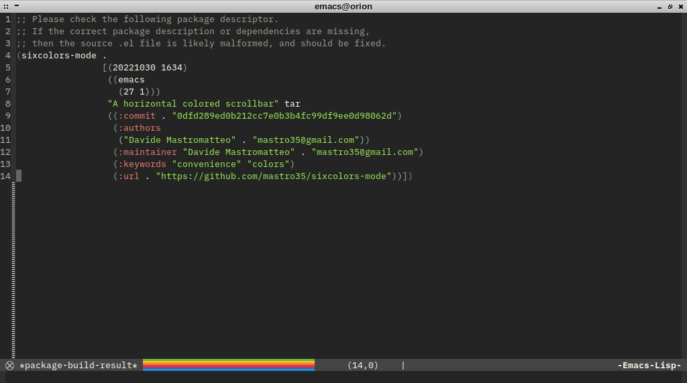
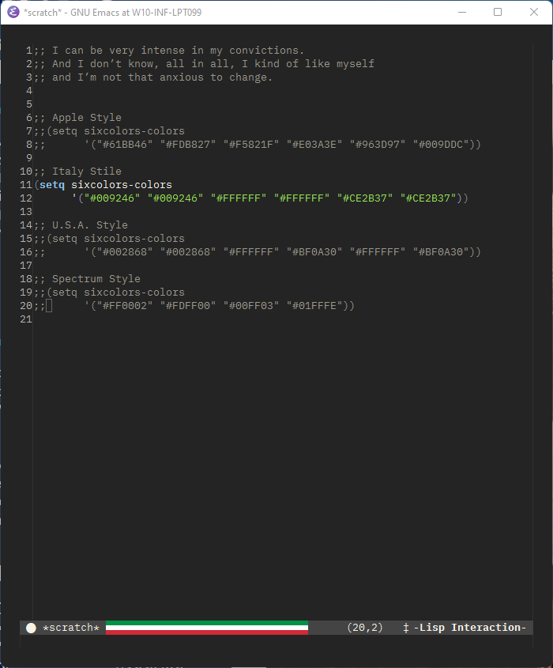
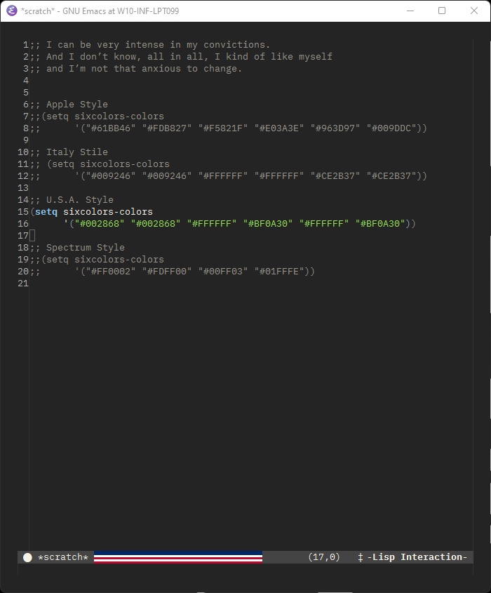
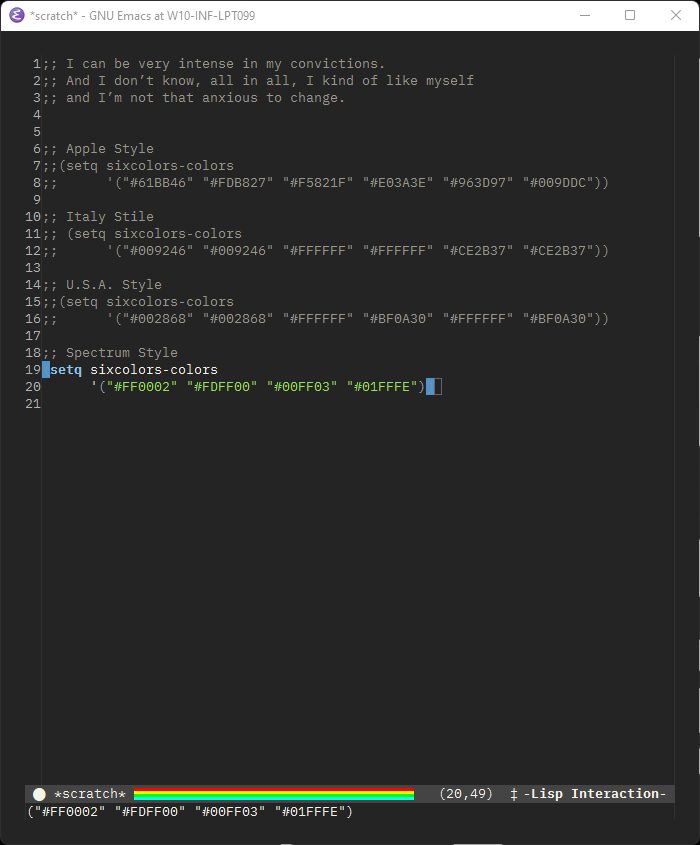

# Six Colors Mode - for Emacs users that bleed in six colors

This software is a homage to the old six colors Apple logo and to what that culture has meant for the community.

It draws a rainbow on the modeline according to the position of the point, so to have a horizontal scrollbar that shows you where the point is relatively to the size of the current buffer.

It's basically a fork of [TeMPOraL Nyan-mode](https://github.com/TeMPOraL/nyan-mode) but without the cat, the animations and the music. 
The rainbow is based on the colors of the six colors rainbow logo that Apple used between 1977 and 1998.

> Apple was 90 days away from going bankrupt back then. 
> Was much worse than I thought when I went back. 
> I actually asked people, ‘Why are you still here?’. 
> And the answer was, ‘Because I bleed in 6 colors.’
>  
> -- Steve Jobs, on his return to Apple

And if you don't like the six-colors Apple logo, you can easily customizing the appearance by using the `sixcolors-colors` variable by using the standard `M-x configure` command under emacs or by manually set it to a list of colors (up to six obviously).

Some example, for italians users like me:

for the americans ones:

and if you are a nostalgic spectrum user:

---

In the next days I will try to release it on MELPA and it will be part of the standard distribution of Six Colors Emacs, a new configuration framework for Emacs I am currently working on and that will be based on a vintage look and curated configuration.

---
